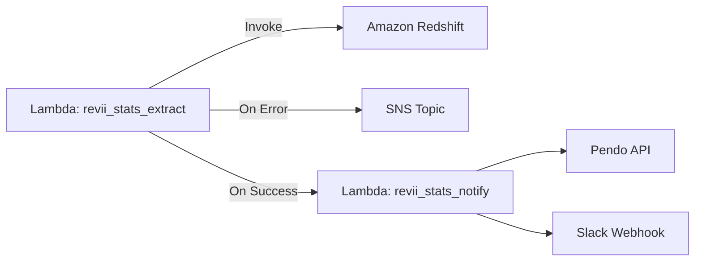

# revii_stats_pipeline

A serverless AWS pipeline to extract metrics from Redshift, process them, and send notifications to SNS and Slack.

## Architecture



## Components

### revii_stats_extract.py
- Connects to Redshift using environment variables.
- Queries daily metrics, churn statistics, coupon stats, and signup-by-coupon stats.
- Aggregates results into a dictionary.
- Invokes the `revii-stats-notify` Lambda with the aggregated data.
- Sends SNS alerts on errors.

### revii_stats_notify.py
- Extracts Pendo feature and page view data for defined segments.
- Builds a formatted Slack message including stats and metrics.
- Sends the message to Slack via a webhook.
- Sends SNS alerts if failures occur.

## Setup

1. Copy `.env.example` to `.env` and fill in the values.
2. Ensure IAM role for Lambdas has permissions for Redshift, Lambda invoke, SNS, and CloudWatch.
3. Create an SNS topic and populate `SNS_TOPIC_ARN`.
4. Deploy Lambdas with environment variables loaded via AWS CLI or your IaC tool of choice.

## Deployment

Example with AWS CLI:

```bash
# Package extract Lambda
zip deployment_extract.zip src/revii_stats_extract.py
aws lambda update-function-code --function-name revii-stats-extract --zip-file fileb://deployment_extract.zip

# Package notify Lambda
zip deployment_notify.zip src/revii_stats_notify.py
aws lambda update-function-code --function-name revii-stats-notify --zip-file fileb://deployment_notify.zip
```

## Testing

- **Local dry-run**:
  ```bash
  export $(cat .env | xargs)
  python src/revii_stats_extract.py
  python src/revii_stats_notify.py
  ```
- **AWS invoke**:
  ```bash
  aws lambda invoke --function-name revii-stats-extract out_extract.json
  aws lambda invoke --function-name revii-stats-notify out_notify.json
  ```

## Monitoring

- View Lambda logs in CloudWatch Logs.
- SNS sends alerts to your subscribed endpoint (e.g., email or Slack via AWS Chatbot).
